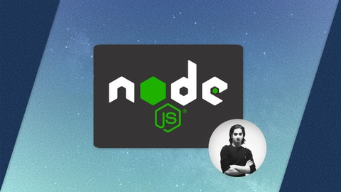

# Node.js Mastery Project

Welcome to my Node.js Mastery Project repository! This project is part of my journey through ["Understanding Node.js Core Concepts"](https://www.udemy.com/course/understanding-nodejs-core-concepts/?couponCode=ST14MT32124) on Udemy. As I dive deep into Node.js, this repository serves as my digital playground and a showcase of what I've learned and built.

## About the Course

"Understanding Node.js Core Concepts" is an in-depth course designed for developers looking to solidify their understanding of Node.js. From basic to advanced topics, this course covers the fundamental aspects of Node.js, ensuring learners grasp the core concepts and practical applications of this powerful runtime environment.

## Purpose of This Repository

- **Learning and Exploration:** The main goal is to document my learning process, allowing me to revisit and reflect on my progress in mastering Node.js.
- **Project Portfolio:** This repository acts as a portfolio of practical Node.js applications and exercises I've developed, demonstrating my skills and growth.
- **Community Engagement:** I aim to engage with the Node.js community, seeking feedback, contributing to discussions, and learning from the collective knowledge of experienced developers.

## Disclaimer

- **Educational Use:** The content within this repository is for educational purposes, showcasing my learning journey through the mentioned Udemy course.
- **Copyright Compliance:** The course content, including videos, code examples, and any other resources, are the intellectual property of the course creator(s). This repository contains my personal code, written as I follow along with the course.
- **Use of Code:** If you wish to use any code or resources from this repository, especially those that might be closely related to the original course materials, please ensure you have permission from the original course creator(s). Adhering to copyright laws and course terms is paramount.

## Contributing

Your contributions are welcome! If you have suggestions, bug reports, or want to contribute code, please feel free to open an issue or a pull request. I'm always looking to improve my understanding of Node.js and enhance the projects within this repository.

## License

This project is licensed under the MIT License - see the [LICENSE.md](LICENSE.md) file for details. Please note that this license does not cover the original course materials or any other copyrighted content.

## Acknowledgments

- Hats off to the creators of "Understanding Node.js Core Concepts" for compiling such a comprehensive and insightful course on Node.js.
- A big thank you to the Node.js community for their invaluable resources, guidance, and support that aid learners like me on our development journey.
